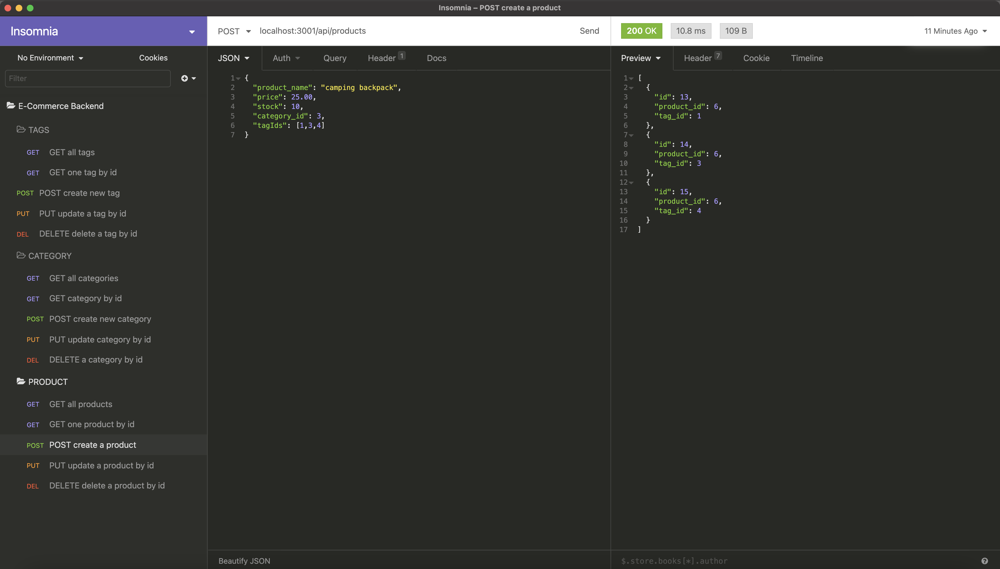

# E-Commerce-Backend

Back end for an e-commerce site. The application is used to GET data for each route(categories, products, or tags) as well as create, update, and delete data in those routes.

## Application running in Insomnia:



## Demo:

a

## Using:

- [Javascript](https://www.javascript.com/)
- [Node.js](https://nodejs.org/en/)
- [Sequelize](https://www.npmjs.com/package/sequelize)
- [MySQL2](https://www.npmjs.com/package/mysql2)
- [Express](https://www.npmjs.com/package/express)
- [Dotenv](https://www.npmjs.com/package/dotenv)

## Installation

To get started clone this repository using
<br>

```terminal
git clone
```

Both Node.js and MySQL must be installed on your computer.

Install dependencies

```terminal
npm init --y
```

```terminal
npm install express sequelize mysql2
```

Open up MySQL shell and input

```terminal
source db/schema.sql
```

and

```terminal
use ecommerce_db
```

Then quit MySQL shell and input the following in your terminal

```terminal
npm run seed
```

to start running application simply input

```terminal
node server.js
```

Open up Insomnia core to GET, POST, PUT and DELETE from different routes.
